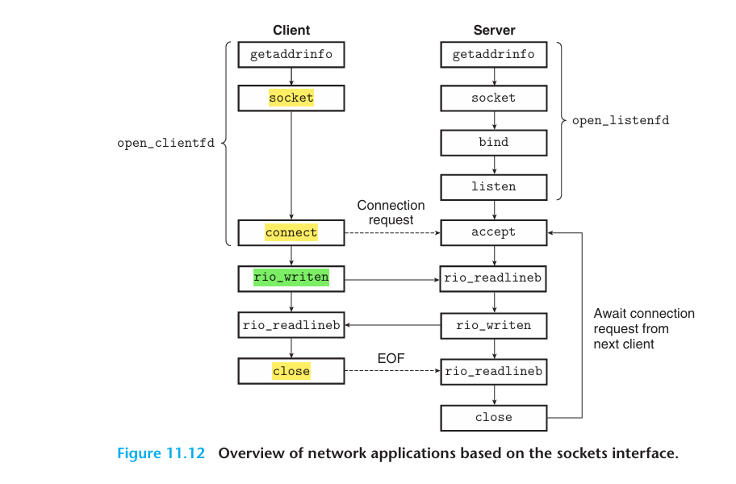
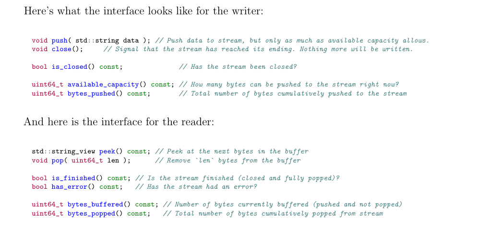

# CS144 Check0

## webget

是一个使用操作系统的 TCP 支持和流套接字抽象通过 Internet 获取网页的程序，就像您在本实验前面手动执行的操作一样。

1. 打开文件 `../apps/webget.cc`。
2. 在获取 URL 函数中，使用您之前使用的 HTTP （Web） 请求的格式实现本文件中所述的简单 Web 客户端。
   > 使用 TCPSocket 和 Address 类。
3. 提示：
   - 请注意，在 HTTP 中，每行必须以`\r\n`结尾（仅使用`n`或`endl`是不够的）。
   - 不要忘记在客户的请求中包含`connection:close`行。
      > 这告诉服务器，它不应该等待你的客户端在此之后发送任何请求。相反，服务器将发送一个回复，表示它关闭其向客户端socket的写入流。
      > 您会发现传入的字节流已结束，因为当您读取来自服务器的整个字节流时，您的套接字将到达`EOF`。这样，您的客户端就会知道服务器已经发出了回复。
   - 确保读取并打印服务器的所有输出，直到套接字到达`EOF`----一次读取调用是不够的。

```shell
# Running
./apps/webget cs144.keithw.org /hello.
# Test
cmake --build build --target check_webget
 ```
具体流程如图所示：
1. `Create TCPSocket`
2. `Connect(Address(host, port(or service)))`
3. `Write HTTP massage`
4. `Read receive form server`
5. `Close`


## An in-memory reliable byte stream

到目前为止，您已经了解了可靠字节流的抽象在通过`Internet`进行通信时是如何有用的，即使`Internet`本身仅提供`尽力而为`（不可靠）数据报的服务。

为了完成本周的实验，您将在一台计算机的内存中实现一个提供此抽象的对象。

- **按序到达**：在`input`写入，可以按相同的顺序从`output`端读取。

   字节流是有限的：写入器可以结束输入，然后不能再写入字节。当读取器读取到流的末尾时，它将到达“EOF”（文件末尾），并且无法读取更多字节。

- **流量控制**:以限制其在任何给定时间的内存消耗。对象使用特定的“容量”进行初始化：在任何给定点，它愿意存储在自己的内存中的最大字节数。字节流将限制写入器在任何给定时刻可以写入的量，以确保流不超过其存储容量。当读取器读取字节并将其从流中排出时，允许写入器写入更多内容。

> 您的字节流用于**单个线程**，您不必担心并发写入器/读取器、锁定或争用条件。

> **需要明确的是：字节流是有限的**，但在写入器结束输入并完成流之前，它几乎可以任意长。

> 您的实现必须能够处理比容量长得多的流。容量限制在给定点内存中保存的字节数（写入但尚未读取），但不限制流的长度。容量仅为 1 个字节的对象仍然可以携带 TB 和 TB 长的流，只要写入器一次写入一个字节，并且读取器在允许写入器写入下一个字节之前读取每个字节。



---

如果所有测试都通过，则 check0 测试将运行实现的速度基准测试。任何速度超过`0.1 Gbit/s`（换句话说，每秒 1 亿比特）都是可以接受的.(实现的执行速度可能超过 10 Gbit/s，但这取决于计算机的速度，不是必需的。)

```bash
cmake--build build--target format (to normalize the coding style)
cmake--build build--target check0 (tomake sure the automated tests pass)
Optional: cmake--build build--target tidy (follow good C++ programming practices)
```


基于string的buffer吞吐量约`.45GB/s`, 性能瓶颈大概在string在头部插入删除的效率并不高。

为此需要提供一种新的方式:

1. 使用deque, 一种在头部插入删除效率较高的容器
2. 使用string_view 进行 lazy pop