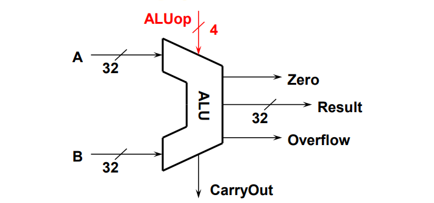
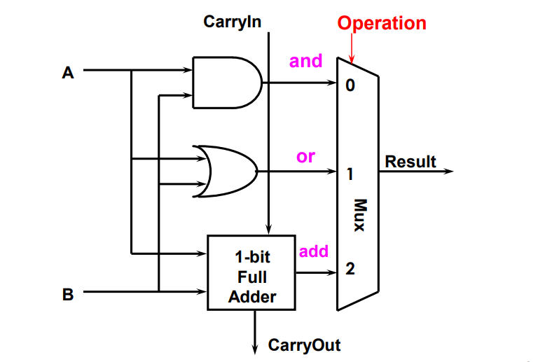
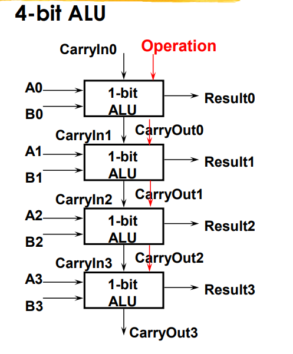
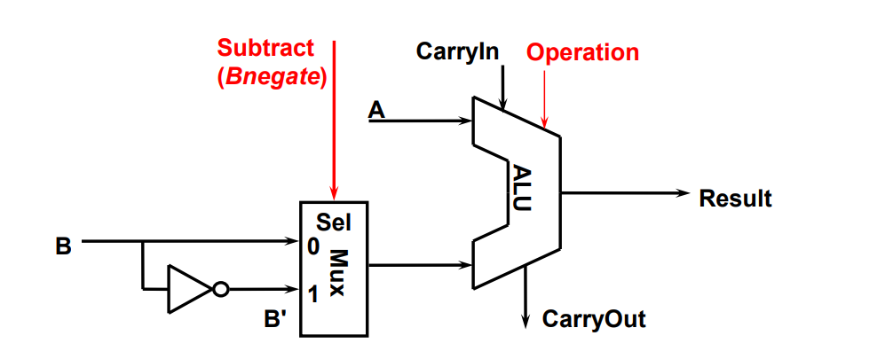
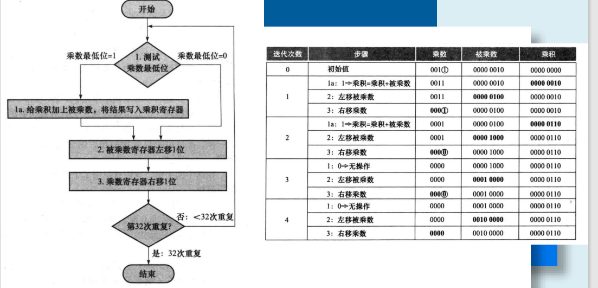
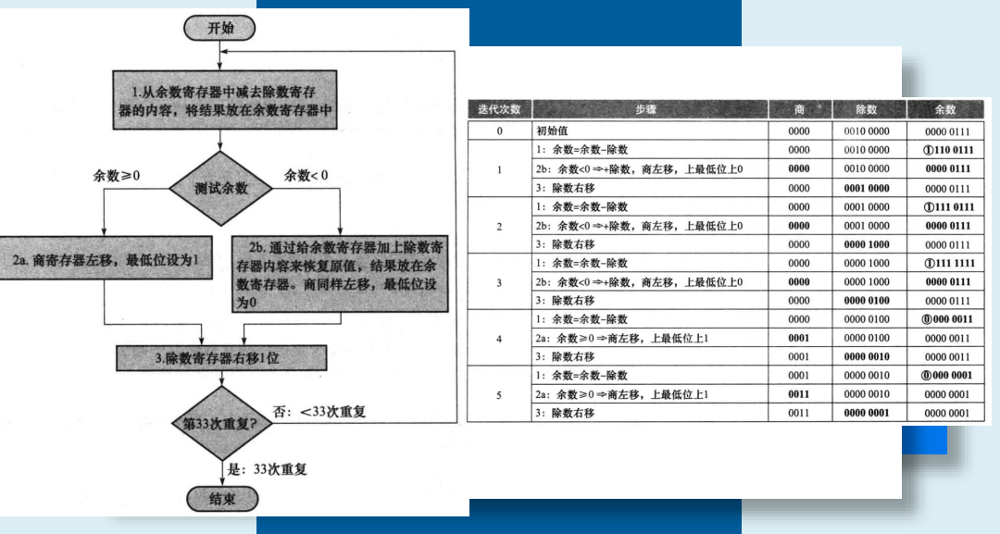

# 1. 算术逻辑单元(ALU)

## 1.1 一个32位ALU的简单模型

| ALU Control(ALUop) |        Function        |
| :----------------: | :--------------------: |
|        0000        |          and           |
|        0001        |           or           |
|        0010        |          add           |
|        0110        |        subtract        |
|        0111        | set on less than ( < ) |
|        1100        |          nor           |

# 2. 加法操作

一个1bit的ALU，通过全加器来实现加法。

## 超前进位加法

通过一定的操作，我们可以提前取得加法的进位部分，进而将串行加法器，变成块间串行，块内并行。

# 3. 减法操作

减法通过公式$-x = \overline x + 1 $，将减法转变成加法来实现。

# 4. 乘法操作

# 5. 除法操作

# Q&A and Potpourri and Summary