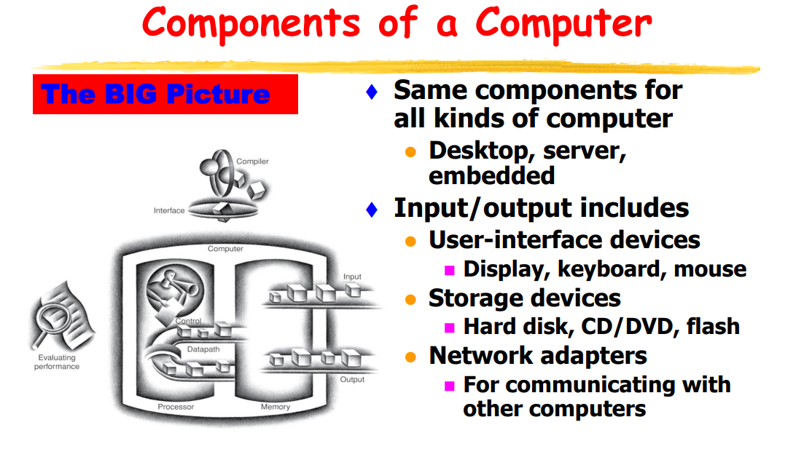
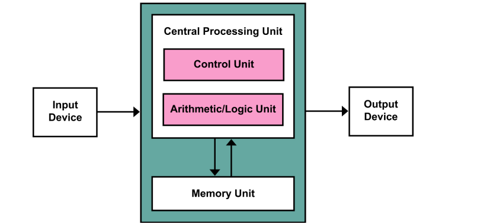
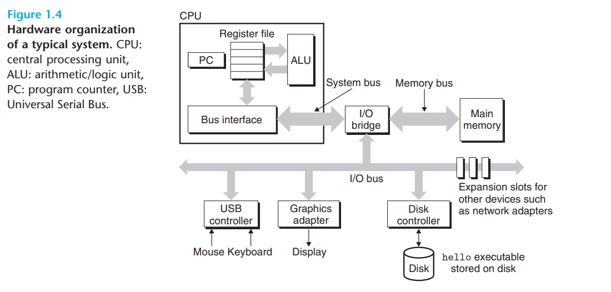
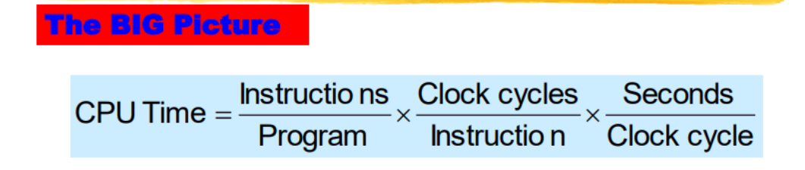
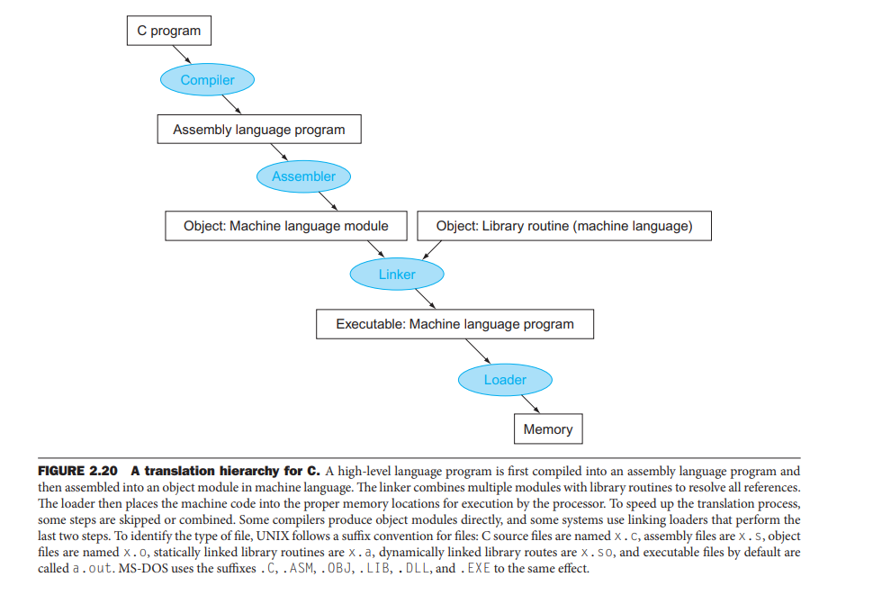

# 1. 冯诺依曼计算机 ⭐

在所有抽象的底部是计算机的五个经典部件:数据通路、控制器、存储器、输入和输出。

# 2. 计算机的基本组成(硬件)

最重要的三个元件:

- CPU(Central Processing Unit)
- Memory
- Disk

## 2.1 从硬件的角度看计算机的组成

1. Bus:
   贯穿整个系统的是一组电子管道,称作总线,它携带信息字节并负责在各个部件间传递。通常总线被设计成传送定长的字节块,也就是字(word)。字中的字节数(即字长)是一个基本的系统参数,各个系统中都不尽相同。
   
   > 现在的大多数机器字长要么是4个字节(32位),要么是8个字节(64位)。

2. I/O device:

   每个I/O设备都通过一个控制器/适配器与I/O总线相连。I/O设备通过控制器/适配器在I/O总线与I/O设备间传递信息。

   > 控制器和适配器之间的别主要在于它们的封装方式。控制器是I/O设备本身或者系统的主板上的芯片组。而适配器则是一块插在主板插槽上的卡。

3. Main memory:

   主存是一个临时存储设备,在处理器执行程序时,用来存放程序和程序处理的数据。

   - 从物理上来说,主存是由一组DRAM芯片组成的。
   - 从逻辑上来说,存储器是一个线性的字节数组,每个字节都有其唯一的地址(数组索引),这些地址是从零开始的。

4. Processor:

   中央处理单元(CPU),简称处理器,是解释(或执行)存储在主存中指令的引擎。

   > 从系统通电开始,直到系统断电,处理器一直在不断地执行PC指向的指令, 再更新PC,使其指向下一条指令。

## 2.2 从程序员的角度看计算机的组成

# 3. Performance ⭐⭐⭐

## 3.1 执行时间--衡量性能的唯一标准

计算机的性能用执行时间来衡量。认为计算机的性能是执行时间的倒数，用此来比较不同计算机的性能高低。
$$
Performance = \frac {1} {CPU_{time}}
$$

执行时间由CPU的时钟周期数，与每个周期的长度共同决定。

$$
CPU_{time} = CPU_{clockCycles} * clockCycleTime
$$

由于周期与频率有倒数关系，所以公式也可以写成CPU的时钟周期的数量除以时钟频率。

$$
= \frac {CPU_{clockCycles}} {clockRate}
$$

我门也可以用其他的方式(CPI)来表示`CPUtime`。
$$
CPU_{time} = instructionCount * CPI * clockCycleTime
$$
同上，也可以写成
$$
= \frac {instructionCount * CPI} {clockcRate}
$$

## 3.2 一个特殊的性能度量参数 `MIPS`

$$
MIPS = \frac {instructionCount} {CPU_{time} * 10^6}
$$

$$
= \frac {clockRate} {CPI * 10^6}
$$

MIPS是指令执行的速率，它规定了性能与执行时间成反比，越快的计算机具有越高的MIPS值。MIPS的优点是既容易理解，又符合人的直觉，机器越快则MIPS值越高。

但实际上使用MIPS作为度量性能的指标存在三个问题。

- 首先，MIPS规定了指令执行的速率，但没有考虑指令的能力。我们没有办法用MIPS比较不同指令系统的计算机，因为指令数肯定是不同的。
- 其次，在同一计算机上，不同的程序会有不同的MIPS，因而一台计算机不能拥有单一的MIPS分值。
- 最后一点也是最重要的一点， 如果一个新程序执行的指令数更多，但每条指令的执行速度更快，则 MIPS 可能独立于性能而发生变化。

## 3.3 Amdahl's Law

定律的主要思想是，当我们对系统的某个部分加速时，其对系统整体性能的影响取决于该部分的重要性和加速程度。

若系统执行某应用程序需要时间为$T_{old}$。假设系统某部分所需执行时间与该时间的比例为$\alpha$，而该部分性能提升比例为$k$。换句话说，该部分初始所需时间为$\alpha T_{old}$,现在所需的时间为$\alpha T_{old} / k$。

因此，总的执行时间应为:
$$
T_{new} = (1 - a)T_{old} + (aT_{old})/k = T_{old}[\ (1-a) + a/k\ ]
$$
可以计算加速比$S = T_{old} / T_{new}$
$$
S = \frac {1} {(1-a) + a/k}
$$

# 4. 程序从编译到执行的过程 ⭐⭐

首先将高级语言程序编译成汇编语言程序，然后用机器语言组装成目标模块。链接器将多个模块与库程序，组合在一起以解析所有引用。然后，加载器将机器代码放入适当的存储器位置以供处理器执行。

为了加快转换过程，可以跳过或将一些步骤组合 。一些编译器直接生成目标模块，一些系统使用链接加载器执行最后两个步骤。

# Q&A and Potpourri and Summary

1. 2017年公布的全球超级计算机TOP 500排名中，我国“神威·太湖之光”超级计算机蝉联第一，其浮点运算速度为93.0146 PFLOPS，说明该计算机每秒钟内完成的浮点操作次数约为( )。

   A. $9.3 * 10^{13}$ 次

   B. $9.3 * 10^{15}$ 次

   C. 9.3 千万亿次

   D. 9.3 亿亿次

   > 本题的难点是计算换算单位。一个简单的估计公式是: $2^{10} \approx 10^3$。同时，$P = 2^{10}T = 2^{20}G = 2^{30}M = 2^{40}K = 2^{50}B$
   >
   > 进而估计可知，$P = 10^{3}T = 10^{6}G = 10^{9}M = 10^{12}K = 10^{15}B$
   >
   > 因为一亿为$10^8$,所以可以得出，本题选D。

2. 假定计算机M1和M2具有相同的指令集体系结构(ISA)，主频分别为1.5 GHz和1.2 GHz。在M1和M2上运行某基准程序P，平均CPI分别为2和1，则程序P在M1和M2上运行时间的比值是()。

   A. 0.4

   B. 0.625

   C. 1.6

   D. 2.5

   > 本题是对性能基本公式的考察， $Time_{CPU} = = \frac {CPU_{clockCycles}} {clockRate}$。要熟记基本公式。

3. 某计算机主频为1.2GHz，其指令分为4类，它们在基准程序中所占比例及CPI如下表所示。该机的MIPS数是()。
| 指令类型 | 所占比例 | CPI  |
| :------: | :------: | :--: |
|    A     |   50%    |  2   |
|    B     |   20%    |  3   |
|    C     |   10%    |  4   |
|    D     |   20%    |  5   |

A. 100 

B. 200

C. 300

D. 600

> 本题考查了关于MIPS计算的相关知识，公式是$MIPS = \frac {clockRate} {CPI * 10^6}$。本质是计算`IPS`，之后除以$10^6$

4. 假定基准程序A在某计算机上的运行时间为100秒，其中90秒为CPU时间，其余为I/O时间。若CPU速度提高50％，I/O速度不变，则运行基准程序A所耗费的时间是()。

   A. 55秒

   B. 60秒 

   C. 65秒

   D. 70秒 

   > 本题考查了Amdahl's Law。 加速比的计算公式:$S = \frac {1} {(1-a) + a/k}$。a为系统改变前，改变部分所占的比例。
