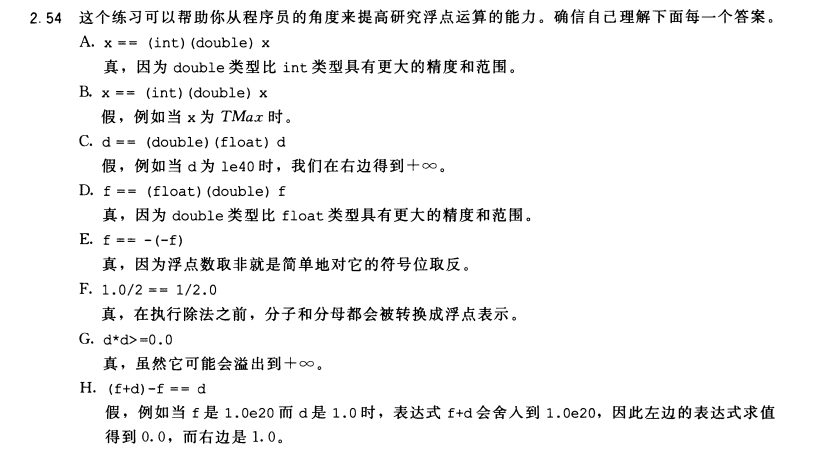

# 1. 数据的表示

## 1.1 无符号数编码的定义(B2U):

$$
For\ \ vector\ \vec{x}= [x_{w−1},\;x_{w−2},\;...,\;x_{0}]: \\
B2U_{w}(\vec x) \doteq \sum ^{w - 1}_{i=0} {x_i*2^i}
$$

无符号数表示的最大数字是$2^{w}-1 \ ,w是二进制位数$。

## 1.2 有符号数(补码)的编码(B2T):

$$
For\ \ vector\ \vec{x}= [x_{w−1},\;x_{w−2},\;...,\;x_{0}]:\\
B2T_{w}(\vec x) \doteq -x_{w-1}*2^{w-1}+\sum ^{w - 2}_{i=0} {x_i*2^i}
$$

> The most significant bit $x^{w-1}$ is also called the sign bit. Its "weight" is $−2^{w−1}$, the negation of its weight in an unsigned representation. When the sign bit is set to 1, the represented value is negative, and when set to 0, the value is non-negative.

补码表示的范围是[$-2^{w-1}$,$2^{w-1}-1$]。

## 1.3 有符号数与无符号数之间的转换(T2U):

$$
For\ x \ such\ that \ \ TMin_{w} ≤ x ≤ TMax_{w}: \\
T2U_{w}(x) = \begin{cases} 
					x + 2^w ,	&x < 0 			\\ 
			\ 	x , &x\geq 0	\end{cases}
$$

在相同长度的无符号和有符号整数之间进行强制类型转换时,大多数C语言实现遵循的原则是底层的位模式不变，仅仅改变解释位的方式。

## 1.4 扩展一个数字的位表示:

1. 无符号数(零扩展):

要将一个无符号数转换为一个更大的数据类型，我们只要简单地在表示的开头添加0。

这种运算被称为零扩展`zero extension`。

2. 补码(符号扩展):

正数添0，负数填1。

这种运算被称为零扩展`sign extension`。

# 2. 数据的运算

## 2.1 加法

### 2.1.1 无符号数加法与溢出

定义运算${+}^{u}_{w}$,表示w位的无符号数加法。
$$
For\ x\ and\ y\ such\ that\ 0 \leq x\ ,\ y < 2^w:\\
x \ {+}^{u}_{w}\  y = \begin{cases} 
					x + y\  ,	&x+y < 2^w \ \ \ \ \ \ \ \ \ \ \ \  \ \ \  \ Normal 			\\ 
					x + y - 2^w, &2^w \leq x + y\leq2^{w+1} \ \ \ Overflow 	
			\end{cases}
$$
对于无符号数而言，溢出的判别是两个大的数字加起来出现一个小的数据。

**无符号数求相反数**

对于无符号数而言，$-x = \overline x$。
$$
For\ any\ number\ x\ such\ that\ 0\ \leq x < 2^w,\\
its\ w\ bit\ unsigned\ negation\ {-}^{u}_{w}x\ is\ given\ by\ the\ following:
\\
{-}^{u}_{w}\  x = \begin{cases} 
					x \  ,	&x = 0			\\ 
					2^w - x, &x > 0 	
			\end{cases}
$$

### 2.1.2 有符号数加法与溢出(⭐⭐⭐)

定义运算${+}^{t}_{w}$,表示w位的补码加法。
$$
For\ integer\ values\ x\ and\ y\ in\ the\ range\ −2^{w−1} \leq x\ ,\ y \leq 2^{w−1} − 1:\\
x \ {+}^{t}_{w}\  y = \begin{cases} 
					x + y - 2^w, &2^{w-1} \leq x + y \ \ \ \ \ \ \ \ \ \  \  \ \ \  \ \ \  \  \  \ Poistive\ overflow			\\ 
					x + y\  ,	&-2^{w-1}\leq x+y < 2^{w-1} \ \ \ Normal 		\\ 
					x + y + 2^w, &x + y<-2^{w-1} \ \ \ \ \ \  \  \ \ \  \ \ \  \  \  \  Negative\ overflow	 	
			\end{cases}
$$
对于补码而言，溢出的判别是两个正数加起来出现一个负数，或者两个负数加起来出现一个正数。

### 2.1.3 **补码求相反数**⭐⭐

$$
For\ x\ in\ the\ range\ TMin_w \leq x \leq TMax_w,\\
its\ two’s\ complement\ negation\  {-}^{t}_{w}x \ \ is\ given\ by\ the\ formula:\\
{-}^{t}_{w}\  x = \begin{cases} 
					TMin_w ,	&x = TMin_w			\\ 
					- x, &x > TMin_w 	
			\end{cases}
$$

即:

- 对于一个补码而言，$TMin_w$的负数是其本身。
- 求一个补码的相反数，可以对其运用公式${-}^{t}_{w}\  x = \overline x + 1,\overline x表示对x按位取反$。⭐⭐

## 2.2 乘法

### 2.2.1 无符号数:

$$
For\ x\ and\ y\ such\ that\ 0 \leq x\ ,\ y \leq UMax_w:\\
x\  {*}^u_{w}\ y = (x \cdot y)mod\ 2^w
$$

### 2.2.2 **补码乘法:**

$$
For\ x\ and\ y\ such\ that\ TMin_w \leq x\ ,\ y \leq TMax_w:\\
x\  {*}^t_{w}\ y = U2T((x \cdot y)mod\ 2^w)
$$

补码与无符号数的乘法具有位级的等价性，即无符号数与补码的乘法在位表示上结果相同。(CSAPP:P102)

# 3. IEEE754 浮点数

## 3.1 二进制小数

小数的二进制表示，可以用公式$fracition * base^{exponent}$表示。

需要关注的点是：

1. **小数的二进制表示法仅仅能表示那些能被写成**  **的数，对于其他值仅能近似表示。**
2. 增加`fraction`部分的长度可以提高表示的精度，例如$1.333$就没有$1.3333333$表示$4/3$来的精准。
3. 增加`exponent`的部分的长度可以提高表示的大小，例如$1*10^{10}$比$1*10^{15}$小。

> 增加fraction部分的长度可以提高表示的精度，而增加exponent的部分可以提高表示的大小。
>
> 但是计算机的位数总是有限的，所以我们必须要在fraction与exponent之间作出取舍。如果我们fraction的长度过长，那么尽管获得了超高的精度，但是我们可以表示的数字就只能在很小的一个范围里了。

## 3.2 Floating Pointer(IEEE 754 standard)

### 3.2.1 规格化的值(normalized number)

规格化的值的公式可以写作: $V = (-1)^{sign} \times (1.0 + fraction) \times 2^E $

> 单精度浮点数使用了1bit表示符号位，8bit表示Exponent(指数部分)，剩余的23bit表示faction(小数部分)。
>
> 双精度浮点数仅仅是使用了更多的位数表示Exponent与Faction。
>
> 根据我们前面的理论，增加二进制表示的长度可以提高表示的精度与大小。**也就是说，双精度浮点数表示数据，比单精度浮点数更准确，范围也来的更大。**

1. M的范围:

$$
Because\ fraction \in [0,1]\\
then,\ M \in [1,2]
$$


2. E与exponent的范围:
   $$
   x^t_8 \in [-128,127] \\
   exponent \in [-127,126]\\
   E = exponent + 127 \in [0,254]
   $$

> 由于我们E的范围是[0,254]，所以可以使用无符号数来解释这8bit。如果要计算实际的exponent的值，只需要对使用无符号数解释的这8bit的值减去127，就可以了。

### 浮点数范围

对于规格化的值而言。$E \in [(0000\ 00001)_{bin},(1111\ 1110)_{bin}]$**通过E的范围，可以引申出单精度浮点数可以表示的范围。**所以可以表示的最小数字约为如下(**最接近0的数字**):$\pm 1.0 \times 2^{-126} \approx \pm 1.2 \times 10^{-38}$

同理可知,单精度浮点数的最大的规格化的值为:$\pm 2.0 \times 2^{127} \approx \pm 3.4 \times 10^{38}$

双精度浮点数同理，只不过表示的范围更精确。

- 最小:$$\pm 1.0 \times 2^{-1022} \approx \pm 2.2 \times 10^{-308}$$
- 最大:$\pm 2.0 \times 2^{-1023} \approx \pm 1.8 \times 10^{308}$

### 3.2.2 非规格化的值(not normalized number)

非规格化的数:E = 0，而fraction可以是任意的。如果fraction也为0的话，那么这种情况下表示的数据是0.0。同时，0也存在正负。保留正负的原因我们也解释了，是为了让非常小的数字也可以比较大小，通过判断他们趋近于0的程度与方向。

非规格化值的公式可以写作: $V = (-1)^{sign} \times (0.0 + fraction) \times 2^E $ 

非规格化数有两个用途：

- 提供了一种表示数值0的方法，因为使用规格化数，我们必须总是使$M>1$，因此我们就不能表示0。
- 非规格化数的另外一个用途是表示那些非常接近于0.0的数。它们提供了一种属性，称为逐渐溢出(gradual underflow)。其中，可能的数值分布均匀地接近于0.0。

最后,我们探讨了下非规格化的值的E值为什么是1-Biased，而不是-Biased这样的一个看似违反直觉的表示。发现这样做的目的是让规格化与非规格化的值之间过渡的更自然。

### 3.2.3 特殊值(special number)

#### 最大的数据的表示：±INF

$E = 255(all\ one ), fraction = all \ one$，称这种情况为INF(无穷大)，因为第一位是符号位，所以可以表示正无穷与负无穷。

#### Not a number:非数(NaN)

$E = 255(all\ one), fraction \neq 0$称为NaN(not a number)。

## 3.4 浮点数的运算

### 3.4.1 浮点加法

对于两个浮点数f1，f2， f1 + f2 遵循以下流程:

1. 对阶(`f1 = f2 = min_exponet(f1, f2)`)。
2. 有效位数相加: 对两个数字，进行加法运算(仅小数部分相加，因为阶码此时相同)。
3. 将结果规格化。
4. 检查溢出。
5. 舍入。

> 左规格化: 阶码增加(小数点左移)
>
> 右规格化: 阶码减小(小数点右移)

### 3.4.2 浮点乘法

暂不考察。

# 4. int,float,double格式之间的类型转换

- 从int转换成float,数字不会溢出,但是可能被舍入。
- 从int或float转换成double,因为double有更大的范围,也有更高的精度,所以能够保留精确的数值。
- 从double转换成float,因为范围要小一些,所以值可能溢出成$\pm Inf$。另外,由于精度较小,它还可能被舍入。 
- 从float或者double转换成int,值将会向零舍人。例如, 1.999将被转换成1, 而-1.999将被转换成-1进一步来说,值可能会溢出。(CSAPP:86)

## 练习题

假定变量x、f和d的类型分别是int、float和double。除了f和d都不能等于$+\infty\ ,-\infty, \ NaN$，它们的值是任意的。对于下面每个C表达式，证明它总是为真(也就是求值为1)，或者给出一个使表达式不为真的值(也就是求值为0)。

```c
A. x == (int)(double) x
B. x == (int)(float) x
C. d == (double)(float) d
D. f == (float)(double) f
E. f == -(-f)
F. 1.0 / 2 == 1 / 2.0
G. d * d >= 0.0
H. (f + d) - f == d
```



# Q&A and Potpourri and Summary

1. **关于大端序小端序，不在占用篇幅了。(重点是字节逆序)**

2. **移位运算 in C：**

   - 算术指补符号位，逻辑指补0。仅仅存在于左移。

   - 左移可以看作乘以2的幂次，右移可以看作除以2的幂次(也可以看作小数点向右移动)。

3. **由于存在符号位，我们可以表示正0或者负0。在整数的编码的时候我们避免了这种情况，为什么对于浮点数，我们容许存在了两个零呢？**

   因为对于浮点数而言，保留$\pm 0$是有意义的。正如我们前面关于浮点数范围的讨论，对于从0的左侧或者右侧趋近于0是有实际的数学意义的。这种"趋近"也使我们对于非常小的数字，也可以做比较大小的操作。为了保证这种"趋近"的意义，我们保留了浮点数关于0编码的符号位。

4. **最小可以表示的Denormalized**

   由于fraction有23个bit(单精度)，所以最小能表示的数据是:$1.0 \times 2^{-23} \times 2^{-126} = 1.0 \times 2^{-149}$。

5. **十进制小数转二进制小数的一个方法 ⭐⭐**

$$
8.4375 \ \ ==>\ \  binary\\
8_{dec} = 1000_{bin}\\
0.4375 * 2 = 0.875\  -----\ 0\\
0.875 * 2 = 1.75\ \ \ \ \ -----\ 1\\
0.75*2=1.5\ \ \ \ \ \ \ \ \ -----\ 1\\
0.5 * 2=1.0\ \ \ \ \ \ \ \ \ \ \ -----\ 1
\\ 8.4375_{dec} = 1000.0111_{bin}
$$

6. **考点1：补码与无符号数的表示与运算&& OVERFLOW的议题**

假定在一个8位字长的计算机中运行如下C程序段:

```c
unsigned int x = 134;
unsigned int y = 246;
int m = x;
int n = y;
unsigned int z1 = x - y;
unsigned int z2 = x + y;
int k1 = m - n;
int k2 = m + n;
```

若编译器编译时将8个8位寄存器{R1,...,R8}分别分配给变量x, y, m , n, z1, z2, k1, k2。请回答下列问题。

1. 执行上述程序段后，寄存器R1，R5和R6的内容分别是什么(用十六进制表示)?
2. 执行上述程序段后，变量m和k1的值分别是多少(用十进制表示)?
3. 上述程序段涉及带符号整数加/减、无符号整数加/减运算，这四种运算能否利用同一个加法器辅助电路实现? 简述理由。
4. 计算机内部如何判断带符号整数加/减运算的结果是否发生溢出？上述程序段中，哪些带符号整数运算语句的执行结果会发生溢出?

> 本题考查了关于补码与无符号数表示与运算的知识。 牢记上述公式，例如 关于无符号数的相反数。

7. **考点2：十进制转换成二进制IEEE754 浮点数**

```c
float a = -8.25;
```

其中浮点数使用IEEE 754表示，并且浮点寄存器xmm1为32bit。若a被存放在xmm1中，则xmm1中的内容为?

A. C104 0000H

B. C108 0000H

C. C242 0000H

D. C1C2 0000H

8. **浮点数，整数之间的类型转换，与浮点数，整数的精度问题**

$$
f(n) =  \sum ^{n}_{i=0} {{2}^{i}} = 2^{n + 1} - 1 = 111...1B\ {(n+1\ bit)}
$$

计算f(n)的C语言函数f1如下:

```c
int f1(unsigned n){
  int sum = 1, power = 1;

  for (unsigned i = 0; i <= n - 1; i++){
    power *= 2;
    sum += power;
  }
  return sum;
}
```

将f1中的int都改为float，可得到计算f(n)的另一个函数f2。假设unsigned和int型数据都占32位，float采用IEEE 754单精度标准。请回答下列问题。

1. 当n = 0时，f1会出现死循环，为什么? 若将f1中的变量i和n都定义为int型，则f1是否还会出现死循环? 为什么?

2. f1(23)与f2(23)的返回值是否相等? 机器数各是什么(用十六进制表示)？
3. f1(24)与f2(24)的返回值分别为`33 554 431`和`33 554 432.0`，为什么不相等？
4. $f(31) = 2^{32} - 1$ ,而f1(32)的返回值却是-1；为什么？若使f1(n)的返回值与f2(n)相等，则最大的n是多少？
5. f2(127)的机器数为7F80 0000H，对应的值是什么? 若使f2(n)的结果不溢出，则最大的n是多少？若使f2(n)的结果精确(无舍入)，则最大的n是多少？

> 从int转换成float,数字不会溢出,但是可能被舍入。