# 1. Storage Technologies

本部分主要考查DRAM的结构与计算,DRAM 模块的组织问题, 与其他存储技术的概念问题.

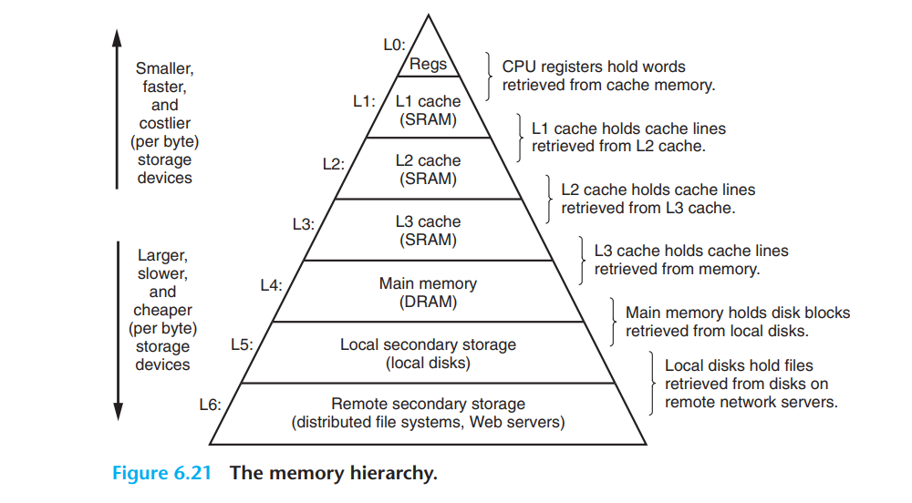

## 1.1 RAM(Random Access Memory)

### 1.1.1 SRAM(Static Random Access Memory)

SRAM存储是一种存储阵列结构的简单集成电路，通常有一个读写端口。虽然读写操作的访问时间不同，但对于任意位置的数据，SRAM的访问时间是固定的。

SRAM不需要刷新电路，所以访问时间可以和处理器的时钟周期接近。为防止读操作时信息丢失，**典型的SRAM每比特采用6个或8个晶体管来实现。**在待机模式下，SRAM只需要最小的功率来保持电荷。

## 1.1.2 DRAM(Dynamic Random Access Memory)

在SRAM中，只要提供电源，数值会被一直保存。而**在DRAM中，使用电容保存电荷的方式来存储数据。采用单个晶体管来访问存储的电荷，或者读取它，或者改写它。**

DRAM的每个比特仅使用单个晶体管来存储数据，它比SRAM的密度更高，每比特价格更低廉。由于DRAM在单个晶体管上存储电荷，**因此不能长久保持数据，必须进行周期性的刷新**。与SRAM相比，这也是该结构被称为动态的原因。

#### 1.1.2.1 常见DRAM

- SDRAM(Synchronous DRAM)
- DDR-SDRAM(Double Data-Rate Synchronous DRAM)

#### 1.1.2.2 Organization of DRAM Chip

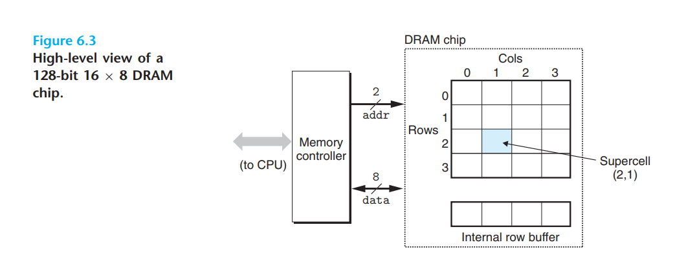

#### 1.1.2.3 Memory Modules

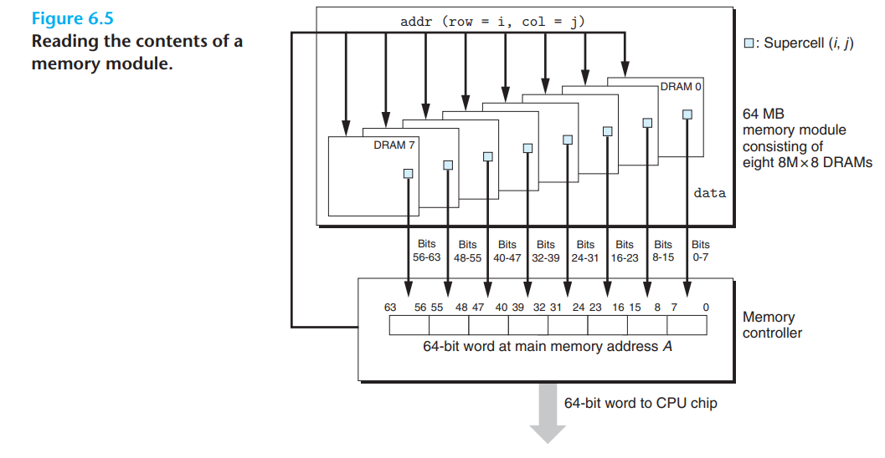

#### 1.1.2.4 交叉编址

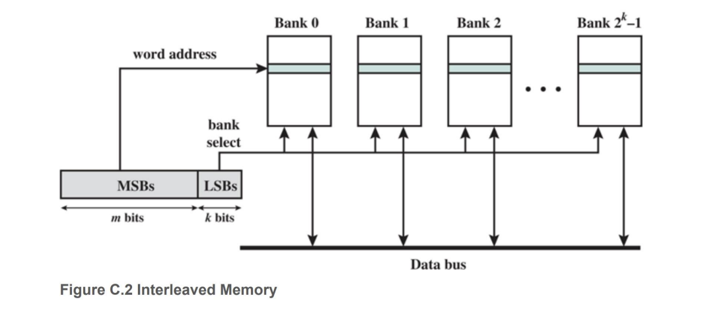

上图展示了一个低位交叉编址的内存模块组织。LSB用于bank select。MSB用于match data(tag is word address)

> 交叉编址分为低位交叉编址，与高位交叉变址。

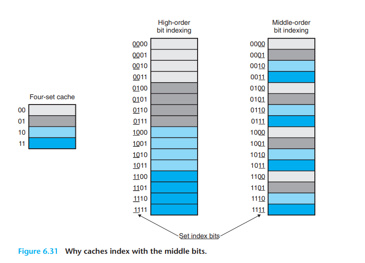

> **为什么用中间的位来做索引?**
>
> 你也许会奇怪，为什么高速缓存用中间的位来作为组索引，而不是用高位。为什么用中间的位更好，是有很好的原因的。图6.31说明了原因。
>
> 如果高位用做索引，那么一些连续的内存块就会映射到相同的高速缓存块。例如，在图中，头四个块映射到第一个高速缓存组，第二个四个块映射到第二个组，依此类推。
>
> 如果一个程序有良好的空间局部性，顺序扫描一个数组的元素，那么在任何时刻，高速缓存都只保存着一个块大小的数组内容。这样对高速缓存的使用效率很低。相比较而言，以中间位作为索引，相邻的块总是映射到不同的高速缓存行。在这里的情况中，高速缓存能够存放整个大小为C的数组片，这里C是高速缓存的大小。

**例题**

某计算机主存按字节编址，由4个64Mx8位的DRAM芯片采用**交叉编址方式**构成，并与宽度为32位的存储器总线相连，主存每次最多读写32位数据。若double型变量x的主存地址为804001AH，则读取x需要的存储周期数是。 

A. 1  B. 2 C. 3 D. 4

## 1.1.3 DIFF SRAM，DRAM

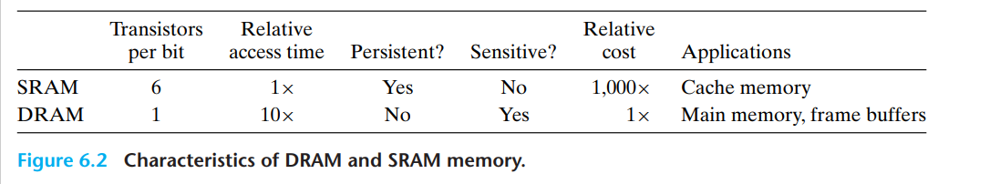

## 1.2 ROM(Read-Only Memory)

- 可编程ROM— Programmable ROM，PROM 
- 可擦写可编程ROM — Erasable Programmable ROM，EPROM PROM每个存储单元有一种熔丝，只能用高电流熔断一次，所以只能被编程一次，通过紫外线照射擦除。
- 电子可擦写ROM — Electrically Erasable PROM，EEPROM 
- 闪存— Flash Memory， 例如：固态硬盘，手机存储等等

### 1.2.1 Flash Memory

闪存读会比写快，因为写需要先擦除，再写入。

## 1.3 Disk

$Time_{存取} = Time_{寻道时间} + Time_{other} + Time_{平均扇区旋转时间} $

例题1: 某磁盘的转速为10000转/分，平均寻道时间是6ms，磁盘传输速率是20MB/s，磁盘控制器延迟为0.2ms，读取一个4KB的扇区所需的平均时间约为（）。

A. 9ms

B. 9.4ms

C. 12ms

D. 12.4ms

>$60 / 100000 * 1/2 = 3ms$
>
>$result = 3ms + 6ms + 4KB/20MB * 10^3 ms + 0.2ms$ 

例题2: 若磁盘转速为7200转/分，平均寻道时间为8ms，每个磁道包含1000个扇区，则访问一个扇区的平均存取时间大约是（）。

A. 8.1ms

B. 12.2ms

C. 16.3ms

D. 20.5ms

> $result = 8ms + 60 / 7200 * 1/2ms$

## 1.4 Summary

某计算机存储器按字节编址，主存地址空间大小为64MB，现用4MBx8位的RAM芯片组成32MB的主存储器，则存储器地址寄存器MAR的位数至少是。 

A. 22位 B. 23位 C. 25位 D. 26位 

> MAR只与主存的地址空间大小有关

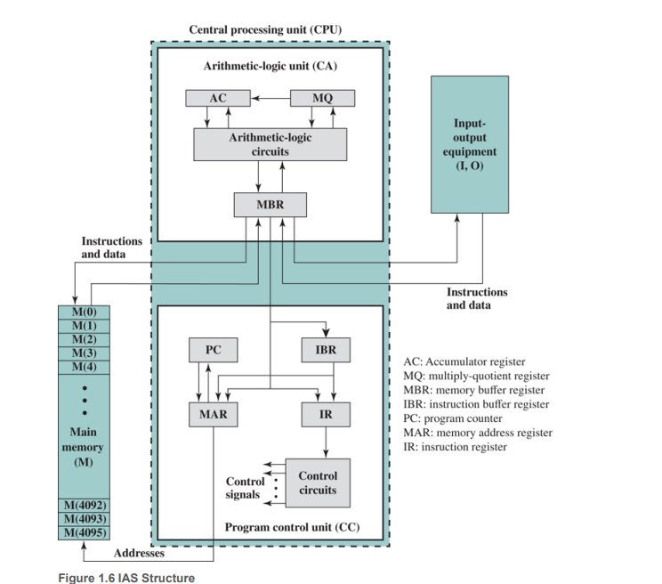

# 2. Cache System

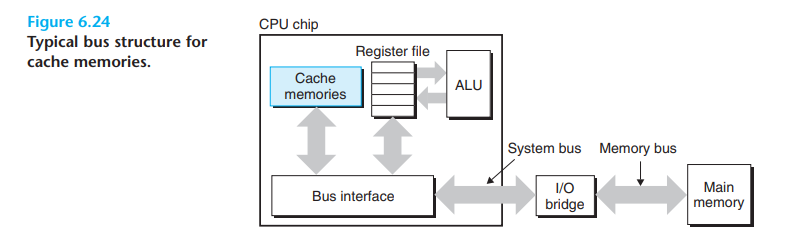

## 2.1 Organization of Cache System(S, E, m, B)

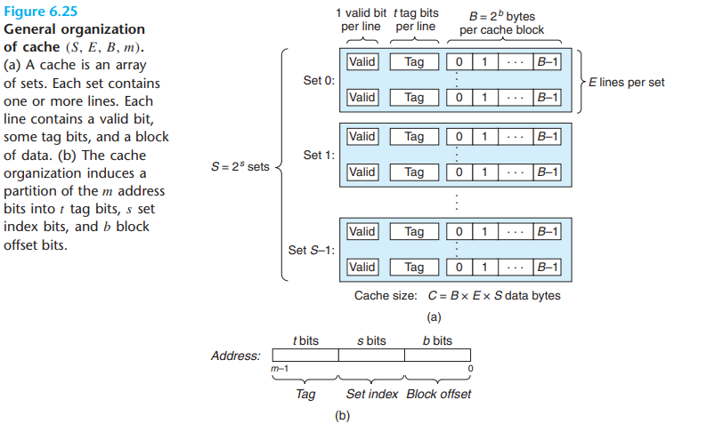

一个内存地址,被解释成

```apl
MemoryAddress{
		Tag; 
		Set_Index;
		Block_offset;
}
```

而一个cache Block 被组织成

```apl
CacheBlock{
		valid;
		Tag;
		Block_data;
}
```

### 2.1.1 Direct-Mapped Caches

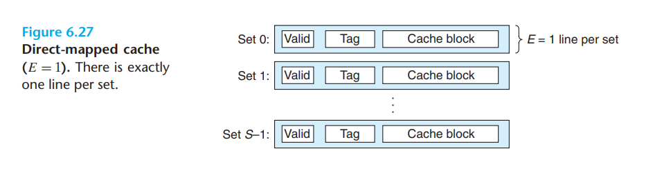

从Cache中读取数据需要三个步骤:

1. 组选择;
2. 行匹配;
3. 字抽取;

下图是一个直接映射缓存的三步走例子.

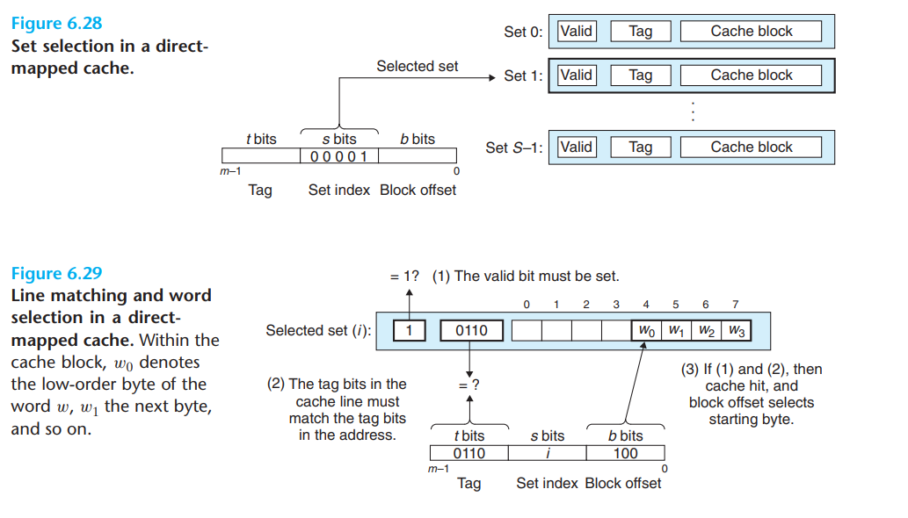

#### 直接映射高速缓存中不命中时的行替换

如果缓存不命中，那么它需要从存储器层次结构中的下一层取出被请求的块，然后将新的块存储在组索引位指示的组中的一个高速缓存行中。

一般而言，如果组中都是有效高速缓存行了，那么必须要驱逐出一个现存的行。对于直接映射高速缓存来说，每个组只包含有一行，**替换策略非常简单：用新取出的行替换当前的行。**

> 直接映射的缺点是会带来一些不必要的冲突不命中。通过在每个组中添加多个行可以解决问题。

### 2.1.2 Set Associative Caches

与直接映射相比,每个组中存在多个行,需要逐一匹配.

#### Read Miss

由于一个组中存在多个行, 因此发生miss时的替换策略成为了一个问题, 不好的策略通常....

通常采用LRU(Least Recently Used)策略.LRU算法需要额外的LRU位.一般来说$LRU\ bits = log_{2}(LineCount\ per \ Set)$.

### 2.1.3 Fully Associative Caches

只有一个组,因此无需进行组选择, 匹配需要对所有条目匹配一次.

## 2.2 Issues With Writes

### Write Hit（写命中）

- write-through（写穿透）

- write-back（写回）

### Write Miss（写不命中）

- write-allocate（写分配）

- no-write-allocate（写不分配）

> 若采用写回+写分配模型, 则需要在cache line中多一个dirty位, 来表示line被替换时,是否需要写回内存.
>
> 写回法指的是若写cache则仅修改cache中的内容直到cache被换出时才修改主存中的内容；
>
> 而写直达法是修改cache时同时修改主存。
>
> 写分配法是把这个未在cache中的块加载到cache中后在进行写；
>
> 而非写分配法指的是直接把这个块在主存中写入。

> 访存次数的多少有时也并不是关键因素，另一个重要的点是两个存储器间的速度差。 比如L3 cache与内存两者都是很快的存储器，即使采用直写与非写分配 也很好。 但是比如memory跟disk之间。由于速度差距太大了，所以说尽可能地推迟写入磁盘的时机是有必要的。

## 2.3 Evaluation of Cache Performance(?)

暂不考察？

# 3. Virtual Memory

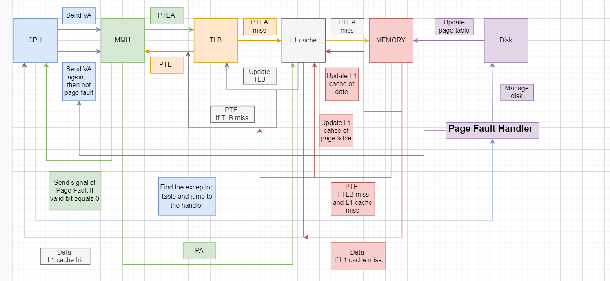

# Q&A and Potpourri and Summary

1. **错题1**

某计算机的存储器总线中有24位地址线和32位数据线，按字编址，字长为32位。如果

00 0000H-3F FFFFH为RAM区，那么需要512Kx8位的RAM芯片数为（ ）。 

A. 8

B. 16

C. 32

D. 64

> **00 0000H - 3F FFFFH 需要22bit.**

2. **错题2：注意编址方式**

假定主存地址为32位，按字节编址，主存和Cache之间采用直接映射方式，主存块大小为4个字，每字32位，采用回写（Write Back）方式，则能存放4K字数据的Cache的总容量的位数至少是。

A. 146K

B. 147K

C. 148K

D. 158K 

3. **考点，关于cache system与virtual memory的综合大题**

**热身题1**

假设计算机M的主存地址为24位，按字节编址；采用分页存储管理方式，虚拟地址为30位，页大小为4KB；TLB 采用二路组相联方式和LRU 替换策略，共8组。请回答下列问题。

1. 虚拟地址中哪几位表示虚页号？哪几位表示页内地址？
2. 已知访问TLB时虚页号高位部分用作TLB标记，低位部分用作TLB组号，M的虚拟地址中哪几位是TLB标记？哪几位是TLB组号？
3. 假设TLB初始时为空，访问的虚页号依次为10，12，16，7，26，4，12和20，在此过程中，哪一个虚页号对应的TLB表项被替换？说明理由。
4. 若将M中的虚拟地址位数增加到32位，则TLB表项的位数增加几位？

**热身题2**

某计算机采用页式虚拟存储管理方式，按字节编址。CPU进行存储访问的过程如下图所示。根据该图回答下列问题。

1. 主存物理地址占多少位？
2. TLB采用什么映射方式？TLB是用SRAM还是用DRAM实现？
3. Cache 采用什么映射方式？若Cache采用LRU替换算法和回写策略，则Cache 每行中除数据（Data）、Tag和有效位外，还应有哪些附加位？Cache总容量是多少？Cache中**有效位的作用**是什么？
4. 若CPU给出的虚拟地址为0008 C040H，则对应的物理地址是多少？是否在Cache中命中？说明理由。若CPU给出的虚拟地址为0007 C260H，则该地址所在主存块映射到的Cache组号是多少？
5. 简单叙述CPU访问cache中的指令部分的过程，(**包括缺失处理)**。
6. 若每个int大小为4B，计算运行下列程序的**cache缺失率**。

```c
for(int i = 0; i < 1024; i++)
	s[k] = 2 * s[k]
```

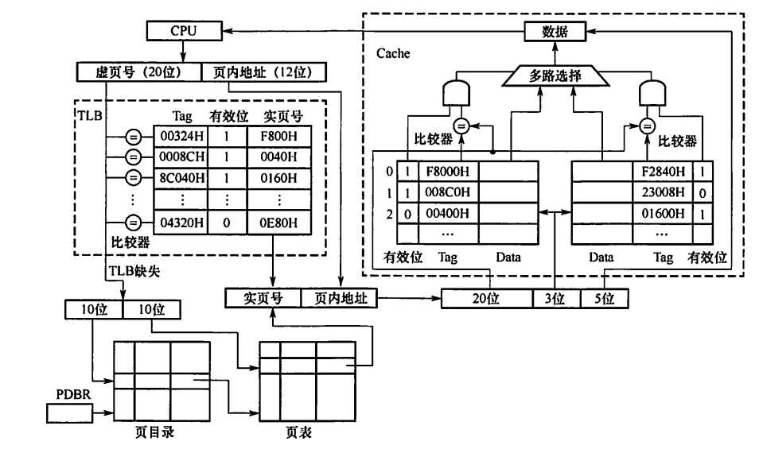