# 一、算术逻辑类指令

## 编译过程

$$
High\ level\ language(e.g.\ C,Java): a = b + c;
$$

$$
Intermediate\ Representation\ for \ MIPS:\ add\ a,\ b,\ c
$$

$$
Assembly\ Language\ for\ MIPS: add\ \ $t0,\ $s1,\ $s2
$$

$$
Machine\ Language\ for\ MIPS:000000\ 10001\ 10010\ 01000\ 00000\ 100000
$$

> 结合第一章的复习。

## MIPS汇编转变成机器语言

### R-format instruction

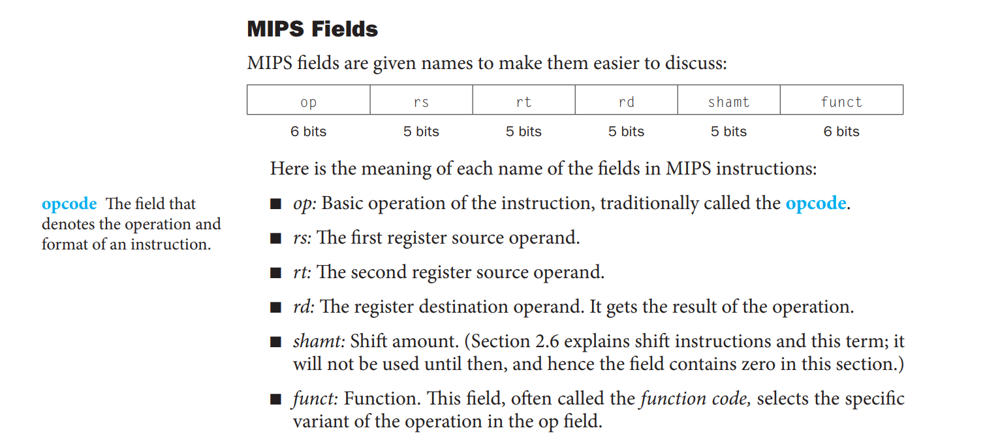

> 操作码与功能码来共同确定一条指令的功能。

### I-format instruction(e.g. addi, load/store)

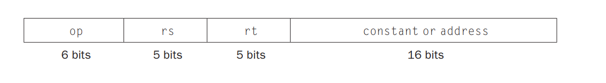

>```assembly
>lw $t0, 8($s3)
>```
>
>s3: 基址寄存器
>
>8: 偏移量

> load与store是I型指令，所以说地址总共有16位地址，意味着`lw`指令可以加载相对于寄存器rs中地址偏移$[-2^{15}, 2^{15} - 1]$个字节的值(32768Byte=>64KB)。

### 补充: 逻辑操作

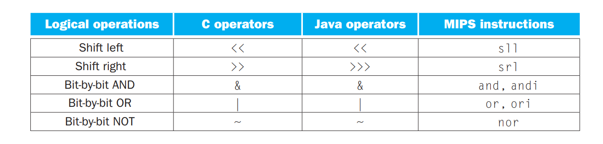

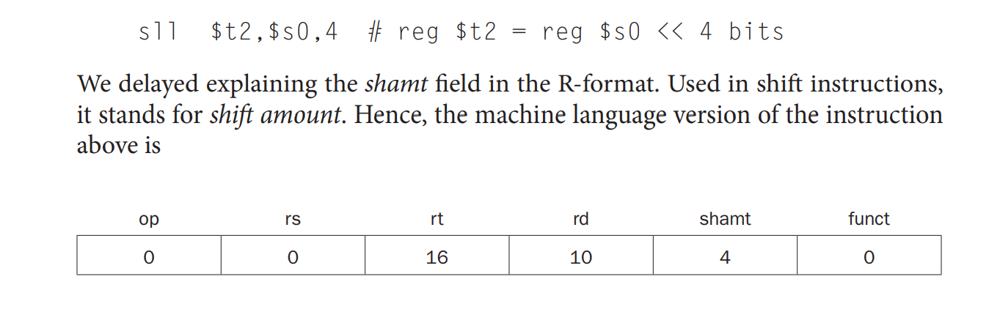

> RS寄存器被置为0，rt表示源操作数($S0)，rd表示目的操作数(\$T2)。shmat表示位移量

### 练习: 手动给指令做翻译

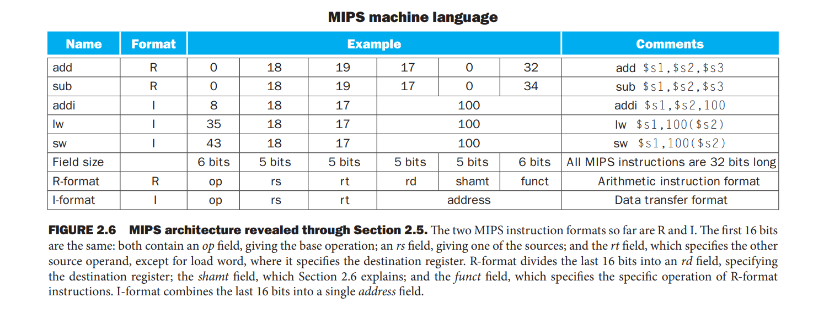

### 练习：猜猜看是那个指令？

> (关于t0，t1，t2的编号，看附录A)

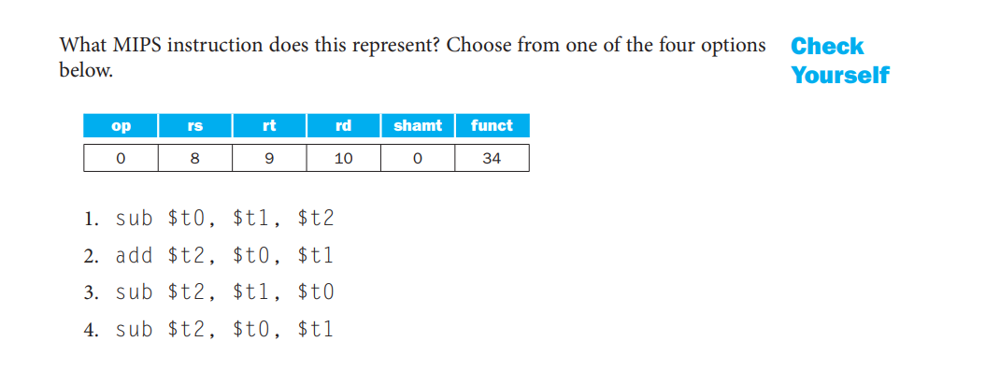

## 存储程序的概念

今天的计算机建立在两个关键原则之上:

1. 指令用数字表示。 

2. 指令存储在内存中以供读取或写入，就像数据一样。这些原则导致了存储程序的概念；

   > 具体来说，内存可以包含编辑器程序的源代码、相应的编译机器代码、编译程序正在使用的文本，甚至是生成机器代码的编译器。
   >
   > 指令作为数字的一个结果是程序通常作为二进制数字文件交付。商业含义是计算机可以继承现成的软件，只要它们与现有的指令集兼容。这种“二进制兼容性”通常会导致行业围绕少数指令集架构进行调整。

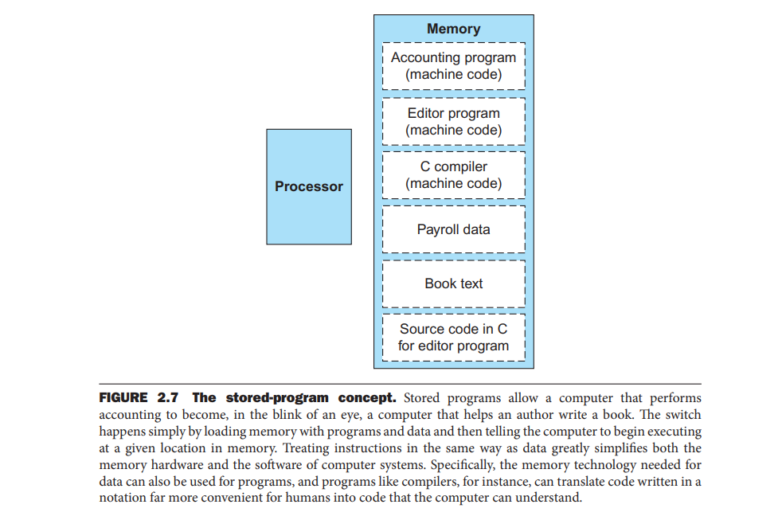

# 二、决策类(BRANCH)指令

> 编译器使用slt、slti、beq、bne和固定值0(总是可以通过读取寄存器＄zero来获得)来创建所有的比较条件：相等、不等、小于、小于或等于、大于、大于或等于。

> SLT: Set Less than

> 在关于条件码寄存器的部分补充全部知识。此处skip

## J-format instruction

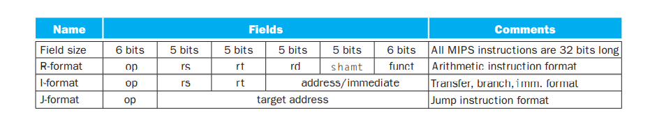

> j-format的格式如上所述，由6位的op与一个target address来表示。与立即数寻址不同的是，jump的寻址范围更大。
>
> Branch类指令属于J-format

## BRANCH指令(J-format instruction)

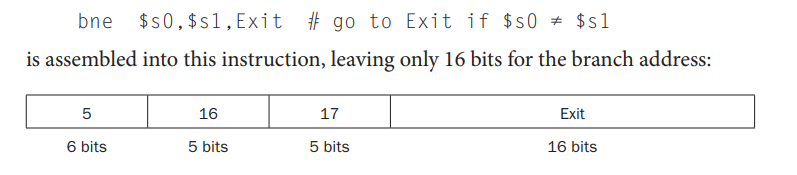

如果这样的话，我们仅仅可以访问16bits的地址空间，因此我们在此采用PC相对寻址:
$$
Program\ counter\ =Register\ +Branch\ address
$$

## SUMMARY: MIPS寻址相关问题的总结。

### 1. 立即数与寄存器寻址

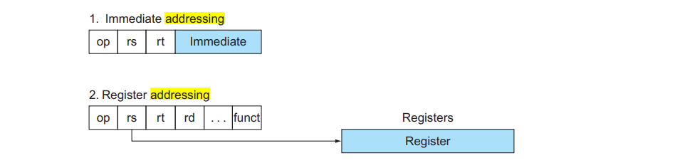

### 2. 基址寻址与PC相对寻址

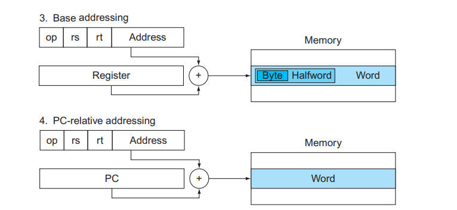

### 3. 伪直接寻址

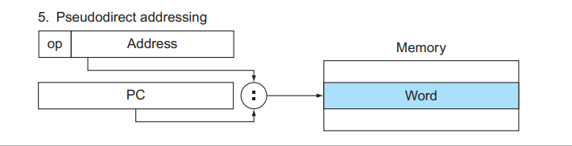

> 由于MIPS按字寻址，所以说PC相对寻址会将16位地址左移2位与PC相加，而伪直接寻址把26位地址左移2位与PC计数器的高4位相连。

### 练习题

**在MIPS中条件分支的地址范围(K=1024)是多大？** 

1. 地址在$0\sim64K-1$之间；
2. 地址在$0\sim256K-1$之间；

3. 分支前后地址范围各自大约32K；
4. 分支前后地址范围各大约128K；

**在MIPS中跳转和跳转链接指令的地址范围(M=1024K)是多大？**

1. 地址在0～64M-1之间
2. 地址在0～256M-1之间
3. 分支前后地址范围各自大约32M
4. 分支前后地址范围各自大约128M
5. 由PC提供高6位地址的64M大小的块中任意地址
6. 由PC提供高4位地址的256M大小的块中任意地址

# 三、对过程的支持

？

# 附录

## A. 调用约定

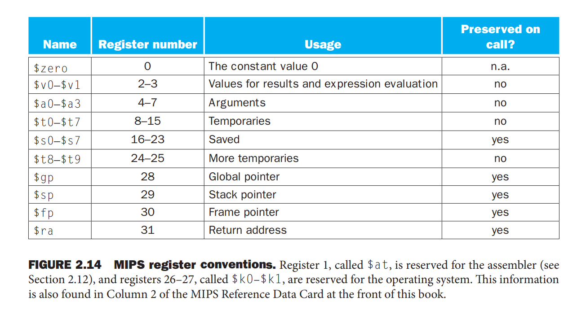

## B. MIPS指令SUMMARY 

见PDF