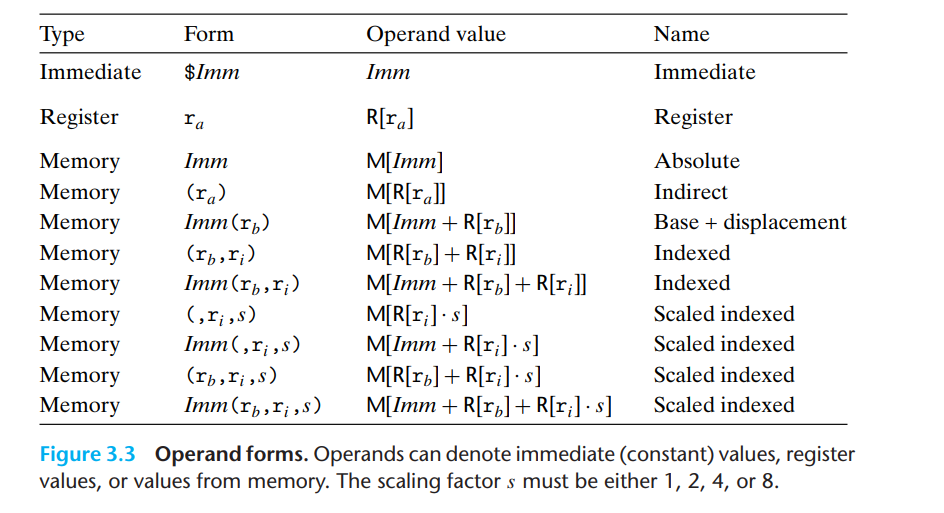
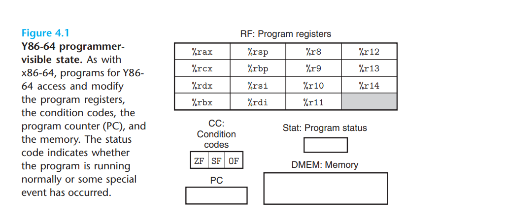
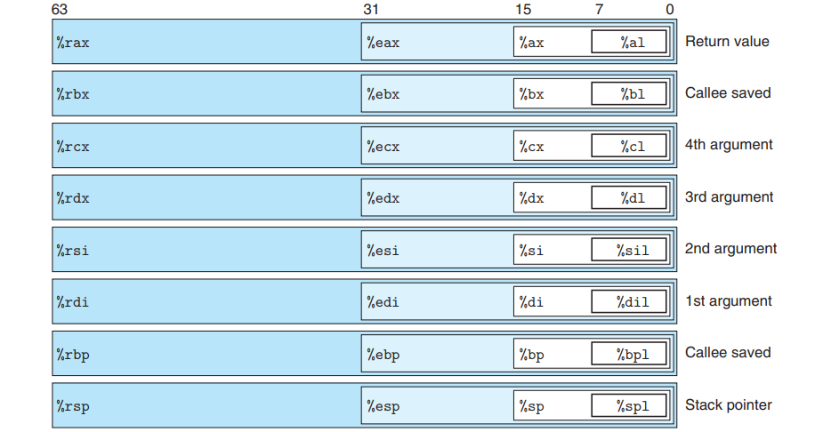
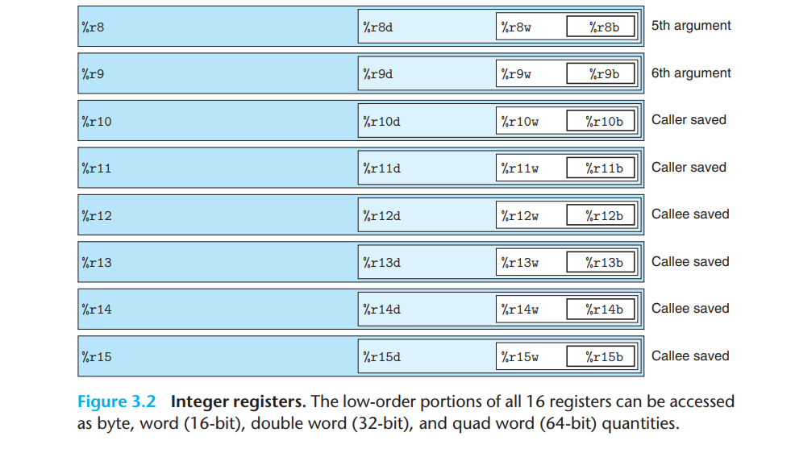
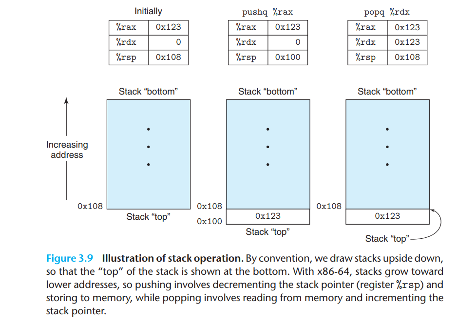
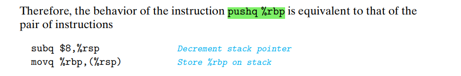
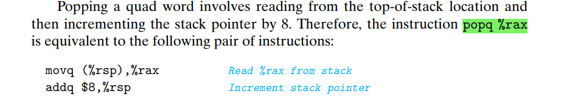

# X86 大杂烩

## X86的操作数

## X86一般采用了INTEL的格式

- Intel代码用不同的方式来描述内存中的位置,例如是‘QWORD PTR [rbx]’而不是 ‘(%rbx)’。
- INTEL格式的目的操作数在前，源操作数在后。

## 程序员可见状态

## 调用约定

## Stack

## 条件码寄存器

如果有涉及条件码的题目，先把这些公式列出来！！！

NOTE！！！: ZF与CF 用于无符号数，SF,OF 用于补码。

### unsigned:

$$
\cellcolor{yellow} a - b < 0 \longrightarrow Set\ CF = 1\\
\cellcolor{yellow}a - b = 0 \longrightarrow Set\ ZF = 1\\
a - b \le 0\longrightarrow CF\mid ZF
\\
 a - b > 0 \longrightarrow \overline {CF \mid ZF} 
							\longrightarrow \overline{CF}\&\overline{ZF}
							\\
a - b \ge 0 \longrightarrow \overline{CF}\&\overline{ZF} \mid ZF
\longrightarrow \overline{CF}
$$

## signed:
$$
\cellcolor{yellow} a - b < 0 \longrightarrow (SF \oplus OF)\\
\cellcolor{yellow}a - b = 0 \longrightarrow Set\ ZF = 1\\
a - b \le 0\longrightarrow (SF \oplus OF)\mid ZF
\\
 a - b > 0 \longrightarrow \overline {(SF \oplus OF) \mid ZF} 
							\longrightarrow \overline{(SF \oplus OF)}\&\overline{ZF}
							\\
a - b \ge 0 \longrightarrow \overline{(SF \oplus OF)}\&\overline{ZF} \mid ZF
\longrightarrow \overline{(SF \oplus OF)}
\\
\oplus: XOR
$$

CF: 进位标志。最近的操作使最高位产生了进位。可用来检查无符号操作的溢出。 

ZF: 零标志。最近的操作得出的结果为0。 

SF: 符号标志。最近的操作得到的结果为负数。 

OF: 溢出标志。最近的操作导致一个补码溢出——正溢出或负溢出。
