# 基本概念

为了更好的解决I/O设备与主机之间连接的灵活与可扩展性。总线连接应运而生。总线是一组进行互联和传输信息(指令、数据和地址)的信号线，是系统多个功能部件信息交换的公共通路。

## 总线主模块和从模块

一个总线操作过程完成两个模块之间的一次信息传递，启动操作过程的是主模块，另外一个是从模块。

某一时刻，总线上只能有一个主模块占用总线

### 总线从模块

处于受控模式，只能在主模块的控制下工作的模块或者设备

# 总线的分类

1. 片内总线: 是CPU芯片内部寄存器与寄存器之间、寄存器与ALU之间的公共连线;

2. 系统总线: 计算机系统各个功能部件(CPU、主存、I/O接口)之间相互连接的总线;

3. 外部总线：计算机系统中设备之间互联，有时也称通信总线。(通信总线),例如UBS、RS232、IEEE488等;

   > I/O总线是外部总线的一种，常见如PCI-E, USB。

# 总线带宽

$$
总线带宽= 总线工作频率*总线宽度/8
$$

# 总线的结构

## 单总线结构

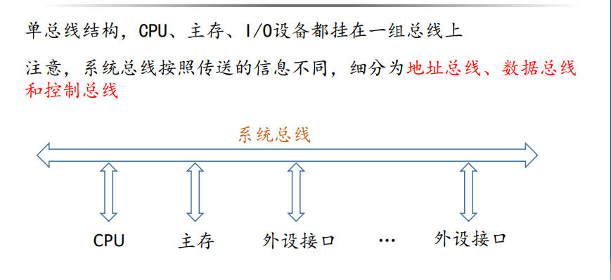

## 双总线结构

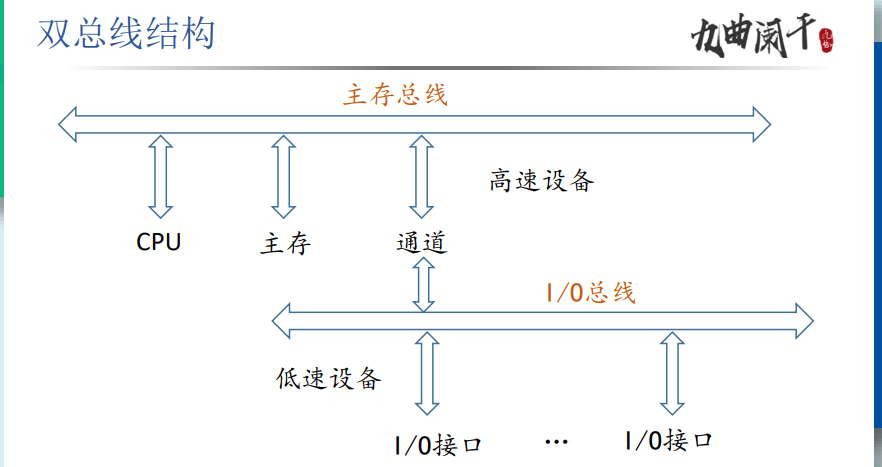

划分高速设备与低速设备，高速总线与低速设备间通过通道相连。

### 多总线结构

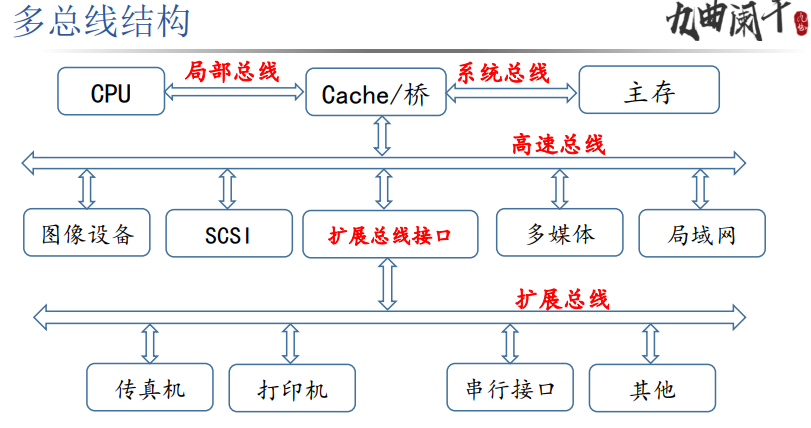

# 常见的总线标准

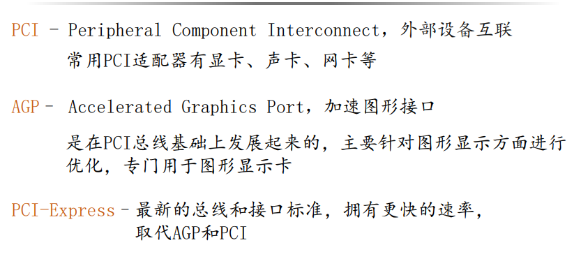

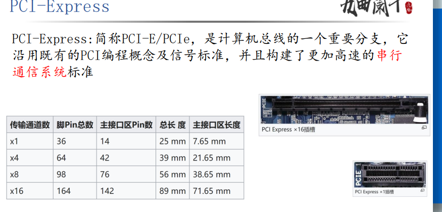

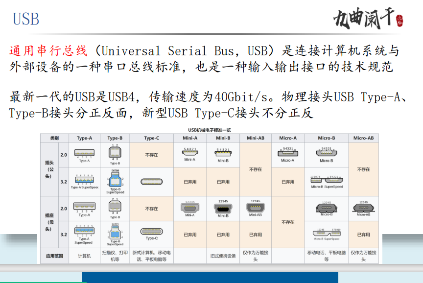

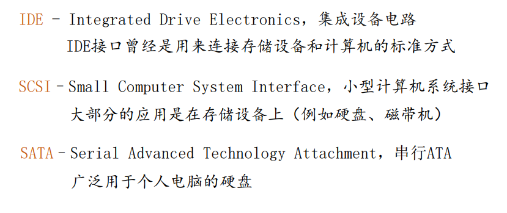

# 总线事务与定时

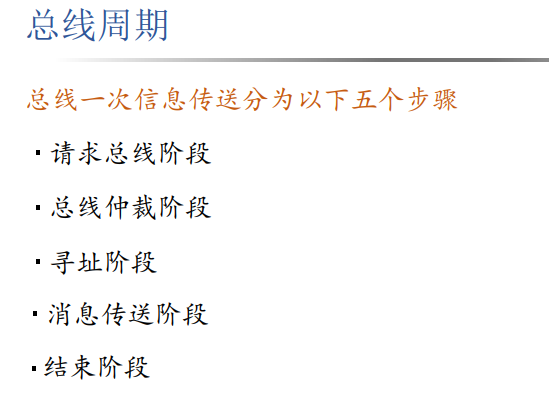、

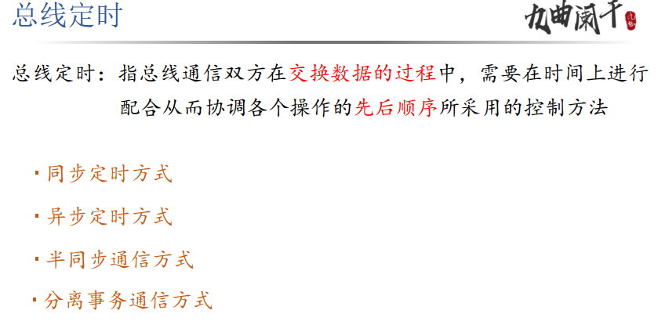

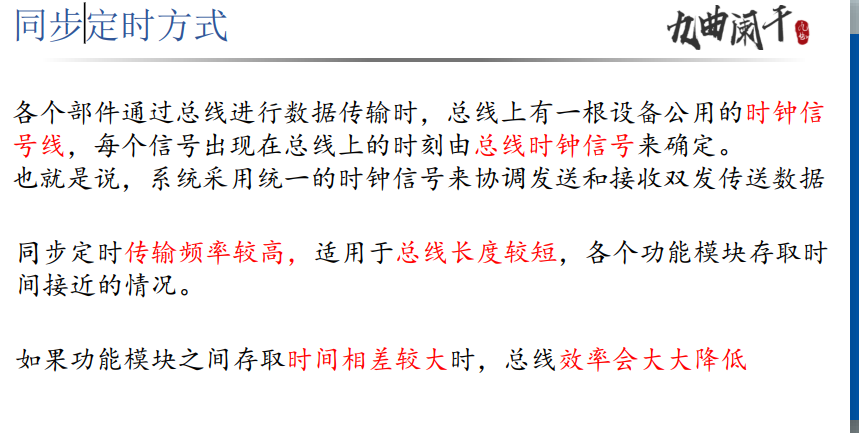

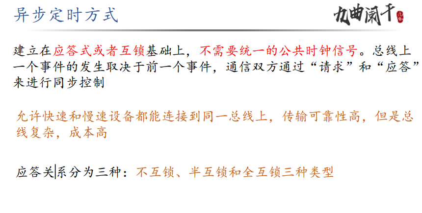

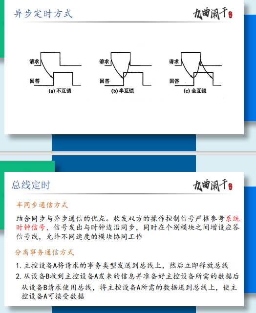